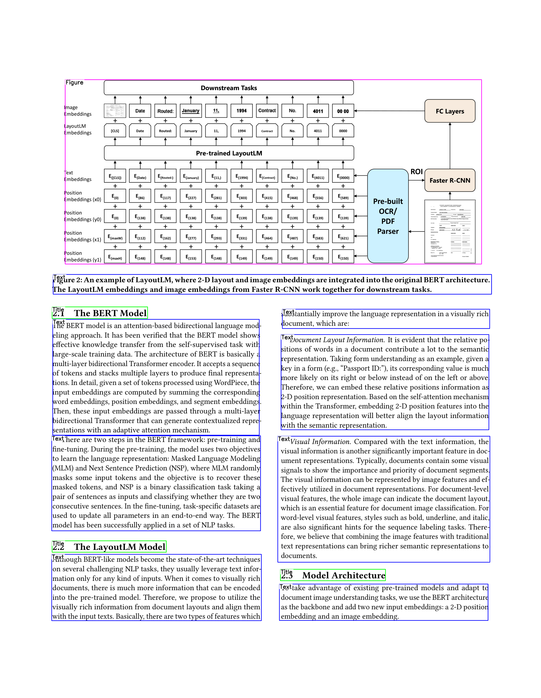
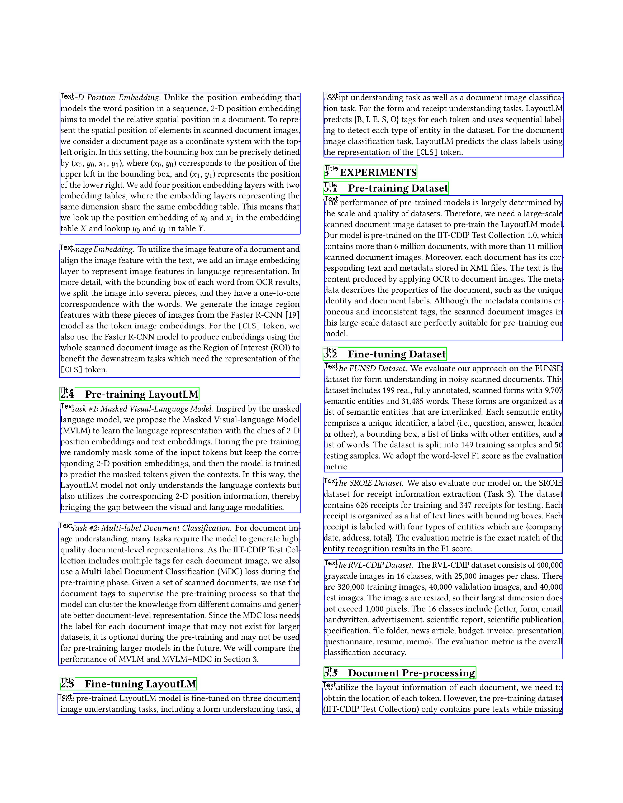
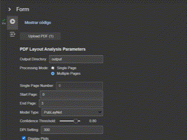

# Document Layout Cluster

A powerful Jupyter/Colab notebook for automatically detecting and analyzing the structural layout of PDF documents using deep learning.

## Overview

This project provides an interactive notebook for analyzing PDF documents to identify different layout elements like text blocks, titles, tables, figures, and lists. It leverages computer vision and pre-trained models to extract document structure without manual annotation, all within a user-friendly Jupyter/Colab interface.

<div align="center">
  <table>
    <tr>
      <td></td>
      <td></td>
    </tr>
  </table>
</div>

## Features

- **Automated layout detection** using state-of-the-art deep learning models
- **Support for multiple document types** with specialized models
- **Flexible page processing** for single or batch page analysis
- **Visualization tools** to display detected layout elements
- **Structured data export** in JSON format
- **Interactive parameters** via notebook widgets to customize analysis
- **No coding required** - use form-based interface to analyze your documents

## Installation

For Google Colab, no installation is required! Simply open the notebook link below.

For local Jupyter usage:

```bash
# Clone the repository
git clone https://github.com/SoftwareSushi/layout-cluster-demo.git
cd layout-cluster-demo
```

### Requirements

- Python 3.7+
- Jupyter Notebook or Google Colab
- LayoutParser
- PyMuPDF (fitz)
- OpenCV
- Matplotlib
- NumPy
- Detectron2
- PyTorch

## Usage

<div align="center">
  
</div>

### Google Colab Notebook

The easiest way to use this tool is through our Google Colab notebook, which provides an interactive interface with form widgets for all parameters.

[Open in Google Colab](https://colab.research.google.com/drive/1fB5F2x6BIL2qobLFb_egExUewa9j4Ihr?usp=sharing)

### Local Jupyter Notebook

If you prefer to run the notebook locally:

1. Install the requirements as shown above
2. Start Jupyter Notebook in the project directory:
   ```bash
   jupyter notebook
   ```
3. Open `Document_Layout.ipynb`
4. Follow the instructions in the notebook and use the interactive widgets

## Available Models

The notebook supports the following pre-trained models:

1. **PubLayNet** (default) - Trained on scientific publications, optimized for academic papers
2. **PrimaLayout** - General document layout model, suitable for a wide range of documents
3. **HJDataset** - Specialized for historical Japanese documents

## Output

The notebook generates two types of output:

1. **Visualizations** - PNG images showing the detected layout elements with bounding boxes and labels
2. **JSON data** - Structured data containing coordinates and types of all detected elements

Example JSON structure:

```json
{
	"0": [
		{
			"type": "Title",
			"confidence": 0.998,
			"coordinates": {
				"x1": 50,
				"y1": 100,
				"x2": 550,
				"y2": 150
			}
		},
		{
			"type": "Text",
			"confidence": 0.985,
			"coordinates": {
				"x1": 50,
				"y1": 200,
				"x2": 550,
				"y2": 400
			}
		}
	]
}
```

## Applications

- Document understanding and digitization
- Preparing data for OCR and text extraction
- Information retrieval from document collections
- Document structure analysis
- Building document databases

## License

MIT

## Acknowledgements

This project uses [LayoutParser](https://layout-parser.github.io/) and builds upon research from the following papers:

- [PubLayNet](https://github.com/ibm-aur-nlp/PubLayNet)
- [PRImA Layout Analysis Dataset](https://www.primaresearch.org/datasets/)
